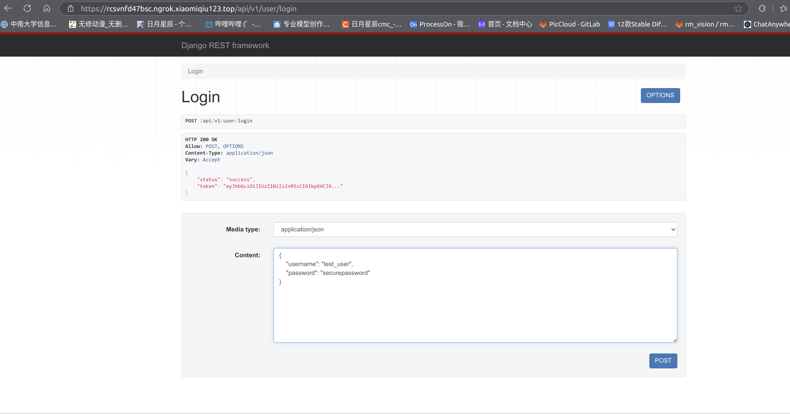

[TOC]

# 影云后端django项目

---

## 一、项目简介

### 1. 项目结构(持续更新)

```bash
.
├── apps
│   ├── accounts
│   ├── ai
│   └── photos
├── black.png
├── LICENSE
├── manage.py
├── media
│   └── avatar
├── pc_django
│   ├── asgi.py
│   ├── __init__.py
│   ├── __pycache__
│   ├── settings.py
│   ├── urls.py
│   └── wsgi.py
├── README.md
└── requirements.txt
```

- apps: 存放应用模块
    - accounts: 用户管理模块
    - ai: 人工智能模块
    - photos: 图片管理模块
- media: 存放上传的图片
- pc_django: 项目的主要代码目录

### 2. 项目环境

- Python 3.10.12
- mysql 8.0.35

环境具体部署参照[pc_docker仓库](http://vlab.csu.edu.cn/gitlab/piccloud/pc_docker)

### 3. phpMyAdmin

基于web和php的数据库管理工具，可以方便地管理mysql数据库。

```
sudo apt update
sudo apt install apache2 mysql-server php libapache2-mod-php php-mysql unzip
sudo apt install phpmyadmin
```

安装phpMyAdmin数据库可视化工具，安装时注意用户名用`root`，密码用`123`。

登录本地phpMyAdmin：http://localhost/phpmyadmin


### 4. 配置宝塔面板(可配可不配)

1. ubuntu2204安装宝塔面板(这个在docker外面)

    ```
    wget -O install.sh https://download.bt.cn/install/install_lts.sh && sudo bash install.sh ed8484bec
    ```

    安装openssh-server，不然无法在宝塔面板中无法使用ssh：

    ```
    sudo apt-get install openssh-server
    ```

2. 登录宝塔面板
   
    蔡明辰的电脑宝塔面下信息：

    ```
    ==================================================================
    Congratulations! Installed successfully!
    =============注意：首次打开面板浏览器将提示不安全=================

    请选择以下其中一种方式解决不安全提醒
    1、下载证书，地址：https://dg2.bt.cn/ssl/baota_root.pfx，双击安装,密码【www.bt.cn】
    2、点击【高级】-【继续访问】或【接受风险并继续】访问
    教程：https://www.bt.cn/bbs/thread-11不然无法再宝塔面板中无法使用ssh7246-1-1.html
    mac用户请下载使用此证书：https://dg2.bt.cn/ssl/mac.crt

    ====================目====面板账户登录信息==========================

    【云服务器】请在安全组放行 16447 端口
    外网面板地址: https://119.39.65.155:16447/36553b08
    内网面板地址: https://100.67.77.5:16447/36553b08
    username: eu60wgit
    password: d3990e16

    浏览器访问以下链接，添加宝塔客服
    https://www.bt.cn/new/wechat_customer
    ==================================================================
    Time consumed: 2 Minute!
    ```

### 5. mySQL配置

遇到一个问题

```
root@e7e23fbad5e7:~/pc_django# mysql -u root -p
Enter password: 
ERROR 2002 (HY000): Can't connect to local MySQL server through socket '/var/run/mysqld/mysqld.sock' (111)
```

> 关于mySQL一个自己给自己挖坑，然后填坑的经历。

1. 大二下学期的数据库课程，我在ubuntu2204上安装了mysql，但是用的是源码安装。
2. 后来因为不想要mysql，所以把源文件删除了，但是不代表卸载了mysql。
3. 后来我又安装了mysql，但是用的是apt安装，安装报错，查看journalctl -u mysql.service，发现一个错误。
4. `Can't open file: 'mysql.ibd' (errno: 0)`，询问GPT得到答案是“这是一个与 InnoDB 存储引擎相关的错误，通常是由于数据库的 mysql.ibd 文件丢失或损坏导致的。”
5. 然后重新初始化数据库系统就好了。

```
sudo rm -rf /var/lib/mysql/*
sudo mysqld --initialize --user=mysql
sudo systemctl start mysql
```

> （每个人都不一样）在这里可以查看临时密码：uc0i>F:;i.WH

使用tcp协议连接mysql：

```
sudo mysql -u root -p --protocol=tcp
```

输入临时密码后，就可以进入mysql命令行了。修改root密码，不修改不让执行别的操作。

```
ALTER USER 'root'@'localhost' IDENTIFIED WITH mysql_native_password BY '123';
FLUSH PRIVILEGES;
```

密码123

### 6. 代码规范纠查

严格按照PEP8规范编写代码。提交GitLab前，请使用black自动格式化代码。

```
sudo apt install black
black .
```


也可以用flake8来检查代码规范。然后手动纠正不规范代码。

```
flake8 .
```


---

## 二、项目运行

### 1. 修改settings配置文件

找到settings.py文件，修改ALLOWED_HOSTS，添加你的外部域名为小米球内网穿透的域名，例如：

```python
ALLOWED_HOSTS = [    
    'rcsvnfd47bsc.ngrok.xiaomiqiu123.top',  # 你的外部域名
    'http://rcsvnfd47bsc.ngrok.xiaomiqiu123.top',  # 如果是 HTTP 协议也需要添加
    'https://rcsvnfd47bsc.ngrok.xiaomiqiu123.top',
    '127.0.0.1',                           # 本地地址
    'localhost',                           # 本地地址
]
```

### 2. 数据库迁移

使用 `python3 manage.py makemigrations` 和 `python3 manage.py migrate` 来创建和应用数据库迁移文件。

```
python3 manage.py makemigrations
python3 manage.py migrate
```

因为使用的是mySQL，所以不会像sqlite3那样自动生成db文件。

### 3. 项目整体运行

```
python3 manage.py runserver
```

如果出现了`Error: That port is already in use.`，说明端口被占用，查看占用端口的进程并杀死之。

```
sudo lsof -i :8000
```

> 用户登录

```
127.0.0.1:8000/api/v1/user/login                       # 内网地址
rcsvnfd47bsc.ngrok.xiaomiqiu123.top/api/v1/user/login  # 小米球外网地址
```

### 4. 接口测试

直接访问接口地址。例如登录接口：127.0.0.1:8000/api/v1/user/login

Django的REST framework提供了一系列的工具，可以方便的直接的输入json的内容调试




