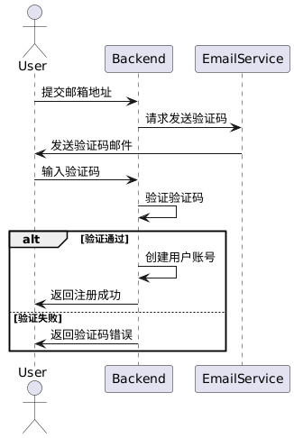

# accounts 应用

> 负责人：李灿

## 一、实现功能

1. 用户注册
2. 用户登录
3. 用户注销
4. 用户信息修改
5. 用户信息查询
6. 用户上传头像
7. 检查用户在线状态
8. 使用refresh token实现token续期
9. 忘记密码使用验证码找回
10. 退出登录

## 二、数据库设计

### 1. 用户表

| 字段          | 数据类型           | 描述               |
| ------------- | ------------------ | ------------------ |
| `id`          | `AutoField`         | 主键               |
| `used_space`  | `FloatField`        | 消耗空间（单位：MB）|
| `username`    | `CharField`         | 用户名（唯一）     |
| `email`       | `EmailField`        | 邮箱（唯一）       |
| `password`    | `CharField`         | 密码               |
| `avatar`      | `ImageField`        | 头像               |
| `date_joined` | `DateTimeField`     | 注册时间           |
| `last_login`  | `DateTimeField`     | 最后登录时间       |
| `is_active`   | `BooleanField`      | 是否在线           |
| `membership`  | `CharField`         | 会员权限（免费、银牌、金牌） |
| `objects`     | `CustomUserManager` | 自定义的用户管理器 |
| `USERNAME_FIELD` | `username`        | 用户名字段         |
| `REQUIRED_FIELDS` | `email`          | 必填字段（邮箱）   |

### 2. 验证码表

| 字段          | 数据类型           | 描述                 |
| ------------- | ------------------ | -------------------- |
| `id`          | `AutoField`         | 主键                 |
| `email`       | `EmailField`        | 邮箱（唯一）         |
| `code`        | `CharField`         | 验证码（6位数字）     |
| `time`        | `DateTimeField`     | 创建时间             |

## 三、详细设计

### 1. 用户注册

